  

  
  

 

<h3>Mobile & Native System</h3>

  

<h3>Web Frontend</h3>

  

<h3>Backend, Automation & Security Scripting</h3>

  

<h3>Database, DevOps & Tool</h3>

  

 
<h3>GitHub Activity</h3>

  
  

  <i>Dedicated to building awesome open-source projects, APIs & Android automation tools.</i>

